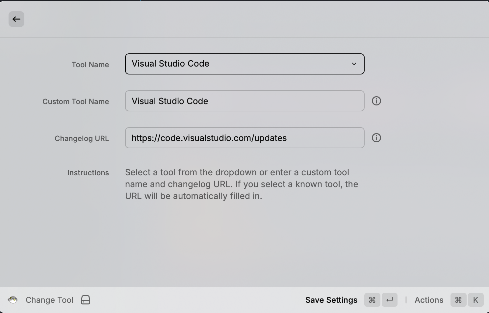

# Software Changelog Tracker Extension for Raycast

A Raycast extension to view and track updates to various software tools and applications.

The extension fetches, parses, and displays changelogs from different software tools, allowing users to stay updated with the latest features and releases.

## Overview

This extension uses firecrawl scraping to extract structured data from changelog websites, processes it into a searchable format, and presents it to users through a clean Raycast interface. It works with many popular tools such as Cursor, Visual Studio Code, GitHub, GitLab, and more.

|  |  |
|--------------------------------------------------------|----------------------------------------------------------|
|  |  |
|--------------------------------------------------------|----------------------------------------------------------|
|  |  |
|--------------------------------------------------------|----------------------------------------------------------|

## Features

- **Multi-Tool Support**: Track changelogs for various software tools, not just Cursor
- **Change Tool**: Easily switch between different software tools to track
- **View Changelog**: Browse through all changelog entries with version filtering and full-text search capabilities
- **Get Latest**: Quickly access the most recent update with detailed info
- **Update Changelog**: Fetch and process the latest changelog data from the software's website
- **Detailed Entry View**: View comprehensive details for each changelog entry
- **External Links**: Open specific release detail pages in your browser
- **Version Range Consolidation**: Intelligently groups consecutive version numbers with the same description

## Setup Requirements

1. Install the extension
2. Sign up for a [Firecrawl](https://firecrawl.dev) account and obtain an API key
3. Add your Firecrawl API key in the extension preferences
4. (Optional) Configure your preferred tool using the Change Tool command

## Commands

### Change Tool

Switch between different software tools to track changelogs for. You can either:
- Select from a list of pre-configured tools including Cursor, VS Code, GitHub, and more
- Enter a custom tool name and changelog URL for any software not in the list

### View Changelog

Browse through all changelog entries for the selected tool. You can search by version number or description text. Select an entry to view its full details.

### Update Changelog

Fetch the latest changelog data from the selected tool's website. This command updates the local database of changelog entries.

### Get Latest

Quickly see the most recent update with its full description for the selected tool.

## Supported Tools

The extension includes pre-configured support for many popular software tools, including:

- Cursor
- GitHub
- GitLab
- Visual Studio Code
- Node.js
- Python
- Docker
- Kubernetes
- React
- Angular
- Vue.js
- Electron
- PostgreSQL
- MySQL
- Slack
- Notion
- ... and many more!

You can also add custom tools by providing a name and changelog URL.

## Development Notes

### Regular Expression Patterns

The extension uses several regular expression patterns to extract information:

- **Individual patches**: `/(\d+\.\d+\.\d+)\s*:?\s*-?\s*([^-:0-9][^0-9]*?)(?=\s*-\s*\d+\.\d+\.\d+|\n|$)/g`
- **Major versions**: `/(?:^|\n)(\d+\.\d+\.x)[\s\S]*?(?=\n\d+\.\d+\.x|\n\d{3,4}|\Z)/g`
- **Detail links**: `/##\s*\[([^\]]+)\]\(([^)]+)\)/`

### State Management

The extension uses React's `useState` and `useEffect` hooks for state management:

```tsx
const [entries, setEntries] = useState<ChangelogEntry[]>([]);
const [isLoading, setIsLoading] = useState(true);
const [searchText, setSearchText] = useState("");

useEffect(() => {
  async function fetchChangelog() {
    try {
      const data = loadChangelog(preferences.toolName, preferences.changelogUrl);
      setEntries(data);
    } catch (error) {
      // Error handling
    } finally {
      setIsLoading(false);
    }
  }
  
  fetchChangelog();
}, [preferences.toolName, preferences.changelogUrl]);
```

## Known Limitations and Future Improvements

- Depends on the structure of the changelog websites
- Could implement a scheduled background update mechanism
- Potential for additional features like changelog diffing between versions
- Could add more specialized parsing for different changelog formats

## Credits

This extension is not affiliated with any of the software tools it provides changelog information for. It fetches publicly available information from their websites. 